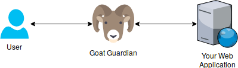

# Goat Guardian

[](http://travis-ci.org/arow-oss/goat-guardian)
[](https://hackage.haskell.org/package/goat-guardian)
[](http://stackage.org/lts/package/goat-guardian)
[](http://stackage.org/nightly/package/goat-guardian)

Goat Guardian is a reverse-proxy authentication server.  You can run it in
front of an existing web application.  It will handle all authentication,
including OAuth and email-based login.

Goat Guardian is meant to make it easy to add support for authentication to
your web application.  It works great for demos, prototypes, internal web
applications, and rapid development with a small team.  It even works well for
larger applications and teams that want an easy way to implement multiple forms
of authentication!

Goat Guardian can be used in front of web applications written in any
language/framework.

## Introduction

Goat Guardian is a reverse-proxy that runs in front of your web application.
It proxies requests to your web application.  It is similar to Apache or nginx.

Here is a simple network diagram of what it looks like to use Goat Guardian:



Goat Guardian received requests from the end-user.  If it is a request to
authenticate, Goat Guardian will directly handle it.  If it is any other
request, it will be forwarded to your web application.

## Language

In this document, *end-user* will be used to refer to to the user of the web
application.  In the diagram above, it is the blue guy all the way to the left.

*Operator* will be used to refer to the person who is setting up and using Goat
Guardian.  In most cases, this will be you, the person reading this document.

*Upstream* or *upstream web app* will be used to refer to the web application
that runs behind Goat Guardian.  In the diagram above, this refers to the web
application all the way to right.  In general, this should be an application that
wants to authenticate users, but doesn't currently have any way to do
authentication.

## Quick Start

First, you must download and build Goat Guardian.  You must have `git` and
[`stack`](https://docs.haskellstack.org/en/latest/README/) installed to be able
to do this:

```sh
$ git clone https://github.com/arow-oss/goat-guardian.git
$ cd goat-guardian
$ stack install
```

This should build and install Goat Guardian as a binary in
`~/.local/bin/goat-guardian`.

You can run it by running the binary, but there are some arguments you must
specify either on the command line or as environment variables.

Here is an example of running `goat-guardian` with all the required arguments:

```sh
$ goat-guardian \
    --twitter-oauth-key Egex7CUsqQqSoEDjMivGtT1r0 \
    --twitter-oauth-secret HCZPPaOmib64GP7QbQaEwrLwKswK8pQDe4UwsAS3EVJBupBj5l  \
    --session-key DORwMBc0sSvGvIDutozVyNnJwU7qTknHkqFWUhpoAElJruHWT0GH7qmTpKajqIxbkuyTN5M5mb9CuM5JECg7SKadylr1QMeZqo1yPexd07KEdMKCbqdxJBmgHoTbBLL8 \
    --redir-after-login-url http://localhost:3000/after-login \
    --sqlite-conn-string example-db.sqlite3
```

An explanation of all the options available is in a following section.

This command will run Goat Guardian on port 3000.  If you open up a web browser
and open http://localhost:3000/twitter/login you will be redirected to twitter
to login.

Accessing any other URL will be reverse-proxied to your upstream web app.
By default Goat Guardian assumes this is at http://localhost:8000/.

For example, if you access http://localhost:3000/some/other/path, Goat Guardian
will reverse proxy the request to http://localhost:8000/some/other/path.
Your upstream web app will need to respond to this request.

If the end-user has logged in with Goat Guardian, Goat Guardian will add a
header `X-UserId`.  The value of the header should be an integer that
corresponds to the ID of the end-user.  An example value will be something like
`1` or `999`. Your upstream web app needs to check for this header upon
receiving a request in order to figure out whether the user has logged in or
not.

Other ways of interacting with Goat Guardian will be explained in a following
section.

## Authentication

Goat Guardian provides multiple ways to perform authentication.  Currently the following are suppored:

- Twitter OAuth
- Email-based login

An explanation of how to use each authentication method is provided in the
following sections.

### Twitter OAuth

Twitter OAuth lets the end-user use Twitter to login to your application.

The login flow with twitter is as follows:

1. Direct the end-user to `/twitter/login` on Goat Guardian.  (By default, this
   will be http://localhost:3000/twitter/login.)

1. Goat Guardian will redirect the the end-user to twitter.com to login.

1. When the user logins in with Twitter, they will be redirected back to
   `/twitter/callback` on Goat Guardian.  Goat Guardian will create a user ID
   in its database, and create a session cookie for the end-user.

1. Goat Guardian will redirect the end-user to `/after-login` (unless it has
   been changed by a command line option).

1. Upon receiving the redirected request to `/after-login`, Goat Guardian will
   add the `X-UserId` header and reverse proxy the request to the upstream web
   app.

The command options and environment variables that affect Twitter OAuth are
listed in a following section.

### Email-based login

Email-based login is quite complicated compared to the other authentication
methods.

Email-based login is actually broken down into multiple flows.  The flows are as follows:

1. Registering a new email address
1. Login with an email address that has already been registered
1. Changing the password if the end-user already know the current password.
1. Resetting the password

Each of these flows is explained in detail in the following sections.

#### Registering a new email address

The flow for registering a new email address is described below:

1. The upstream web app must prepare a page with an HTML form asking the end-user
   for their email adress and a password to use for Goat Guardian.

   It must set the `action` of the form to `POST` and the action to
   `/email/register` for Goat Guardian.  It must have two inputs, with the name
   `email` and `password`.

1. When the end-user submits this form, Goat Guardian will intercept this
   request and send an email to the end-user asking them to confirm their email
   address.

1. When the end-user confirms their email address, they will be redirected to
   `/`.  They are now able to login.

#### Login with an email address that has already been registered

The flow for logging in with an email address that has already been registered
and confirmed is described below:

1. The upstream web app must prepare a page with an HTML form asking the end-user
   for their email adress and a password:

   It must set the `action` of the form to `POST` and the action to
   `/email/login` for Goat Guardian.  It must have two inputs, with the name
   `email` and `password`.

1. When the end-user submis this form, Goat Guardian will intercep this request
   and check the end-user's email and password.  If it is correct, Goat Guardian will
   set a session cookie and redirect the end-user to `/after-login` (unless it has
   been changed by a command line option).

1. Upon receiving the redirected request to `/after-login`, Goat Guardian will
   add the `X-UserId` header and reverse proxy the request to the upstream web
   app.

#### Changing the password if the end-user already knows the current password

The flow for changing the password for the end-user if the current password is known is described below:

1. The upstream web app must prepare a page with an HTML form asking the end-user
   for their current password and the new password to use.

   It must set the `action` of the form to `POST` and the action to
   `/email/change-password` for Goat Guardian.  It must have two inputs, with the name
   `old-pass` and `new-pass`.

1. When the end-user submis this form, Goat Guardian will intercep this request
   and check the end-user's current password.  If it is correct, Goat Guardian will
   change the password and redirect the end-user to `/after-login` (unless it has
   been changed by a command line option).

1. Upon receiving the redirected request to `/after-login`, Goat Guardian will
   add the `X-UserId` header and reverse proxy the request to the upstream web
   app.

#### Resetting the password

Resetting a password involves sending the end-user an email to confirm who they
are.  The flow is as follows:

1. The upstream web app must prepare a page with an HTML form asking the end-user
   for their current password and the new password to use.

   It must set the `action` of the form to `POST` and the action to
   `/email/reset-password-send-email` for Goat Guardian.  It must have two inputs, with the name
   `email` and `next`.  `next` is the URL that Goat Guardian will forward the
   end-user to in order to set their new password.  It is used in step 3.
   It could be something like `http://localhost:3000/email-reset-pass-page`.

1. When the end-user submits this form, Goat Guardian will intercept this
   request and send an email to the end-user asking them to confirm their email
   address.

1. When the end-user confirms their email address, they will be logged-in and
   redirected to the URL specified in the `next` argument in step 1.  The HTTP
   Header `X-UserId` will be set to their user ID.  This page should be an HTML
   form asking the end-user for the new password to use.

   It must set the `action` of the form to `POST` and the action to
   `/email/reset-password` for Goat Guardian.  It must have two inputs, with
   the name `new-pass` and `next`.  `next` is the URL that Goat Guardian will
   forward the end-user to after changing their password.  It is used in the next
   step.  It could be something like `http://localhost:3000`.

1. When the end-user submits this form, Goat Guardian will change the password
   of the end-user and forward them to the URL in the `next` parameter.

### Other Endpoints

There are a few other endpoints provided by Goat Guardian.  They are described below.

#### Logout

Goat Guardian provides an endpoint that lets the end-user logout.  The flow for using this is described below:

1. Have the end-user send a request to `/logout` with a query parameter called `next`.  `next` will be the URL to redirect the end-user to after logging them out.

1. Goat Guardian will intercept this request and delete the session cookie for
   the end-user.  Goat Guardian will then redirect the end-user to the URL from
   the `next` parameter.  Since the end-user has been logged out, Goat Guardian
   will not set the `X-UserId` HTTP header.

## Options

This section lists all the options that can be specified to Goat Guardian.

Command Line Flag | Environment Variable | Default | Description
----------------- | -------------------- | ------- | -----------
`--twitter-oauth-callback` | `GG_TWITTER_OAUTH_CALLBACK_URL` | `http://localhost:3000/twitter/callback` | The callback for the Twitter OAuth.  The user will be redirected here after logging in on Twitter.  This should be a URL controlled by Goat Guardian.
`--twitter-oauth-key` | `GG_TWITTER_OAUTH_KEY` | *(no default)* | The OAuth key to use for Twitter.  This should be a value like `Egex7CUsqQqSoEDjMivGtT1r0`.  You'll need to register with Twitter to get this value.
`--twitter-oauth-secret` | `GG_TWITTER_OAUTH_SECRET` | *(no default)* | The OAuth secret to use for Twitter.  This should be a value like `HCZPPaOmib64GP7QbQaEwrLwKswK8pQDe4UwsAS3EVJBupBj5l`.  You'll need to register with Twitter to get this value.
`--db-conn-string` | `GG_DB_CONN_STRING` | `:memory:` | The connection string to use for the SQLite database used to store the end-user accounts.  By default it just uses an in-memory database which is deleted when Goat Guardian stops running.  You should probably specify this as something like `/some/path/to/my-db.sqlite3` to save the end-user accounts to a file on disk.
`--session-key` | `GG_SESSION_KEY` | *(no default)* | The encryption key used to encrypt/decrypt the session cookie sent to the end-user.  This can be generated by running `goat-guardian --generate-session-key`.
`--redir-after-login-url` | `GG_REDIR_AFTER_LOGIN_URL` | `http://localhost:3000` | The URL to redirect the end-user to after logging in with Goat Guardian.

## Example App

There is an example Servant application implementing all of the authentiation flows described above.  You can find it in the [example-servant-app](./example-servant-app/) directory.

## Origin

Goat Guardian was originally proposed as a
[question](https://security.stackexchange.com/questions/187191/would-a-reverse-proxy-authentication-server-be-a-secure-setup/187219)
on the Information Security Stack Exchange.

## Maintainers

- [Kadzuya Okamoto](https://github.com/arowM)
- [Dennis Gosnell](https://github.com/cdepillabout)
